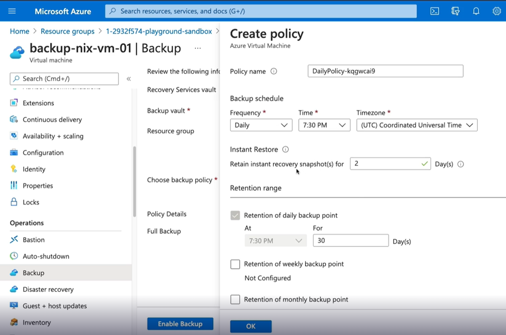
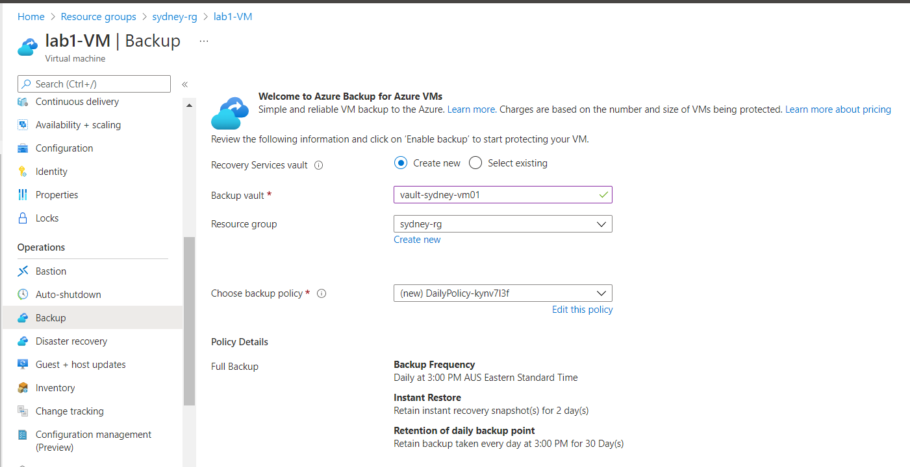
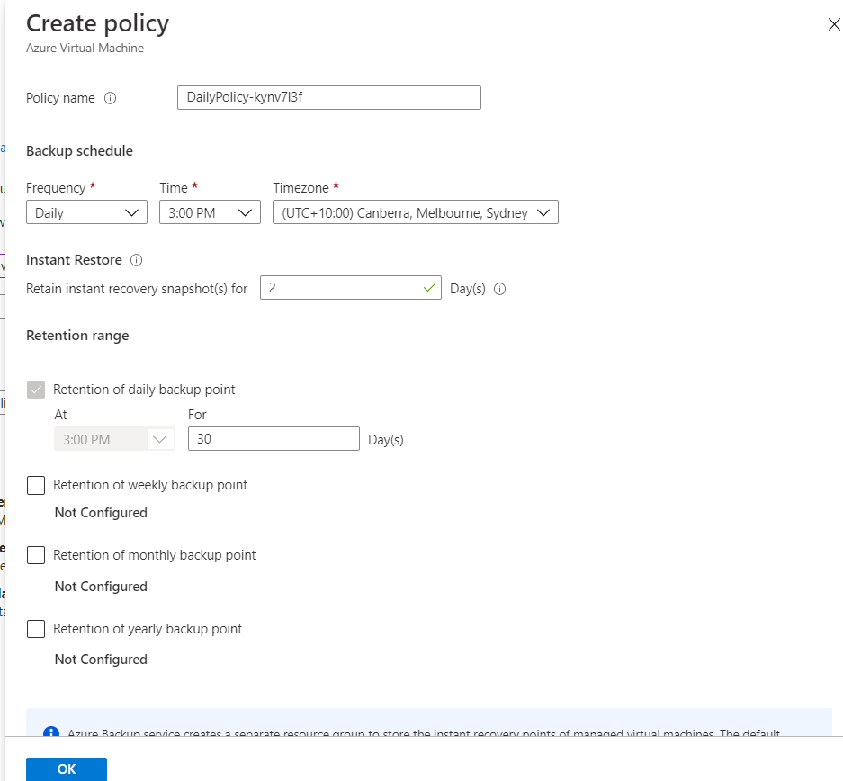
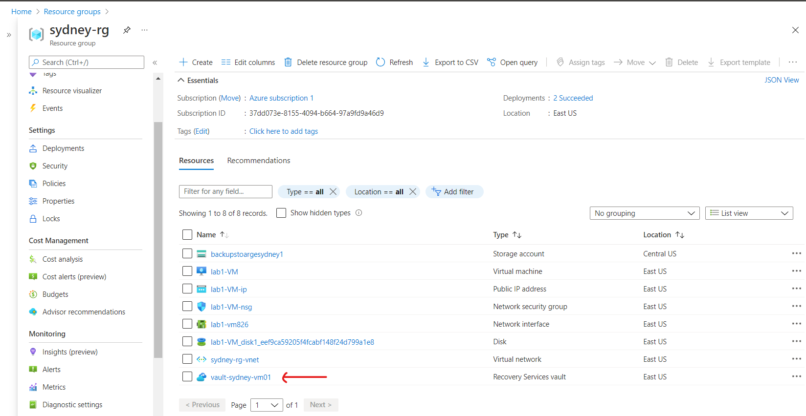
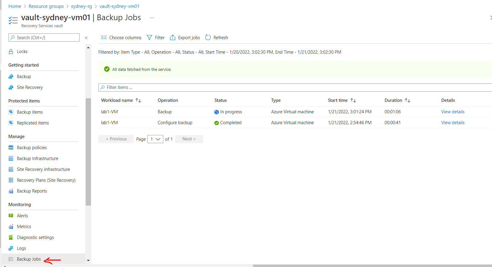
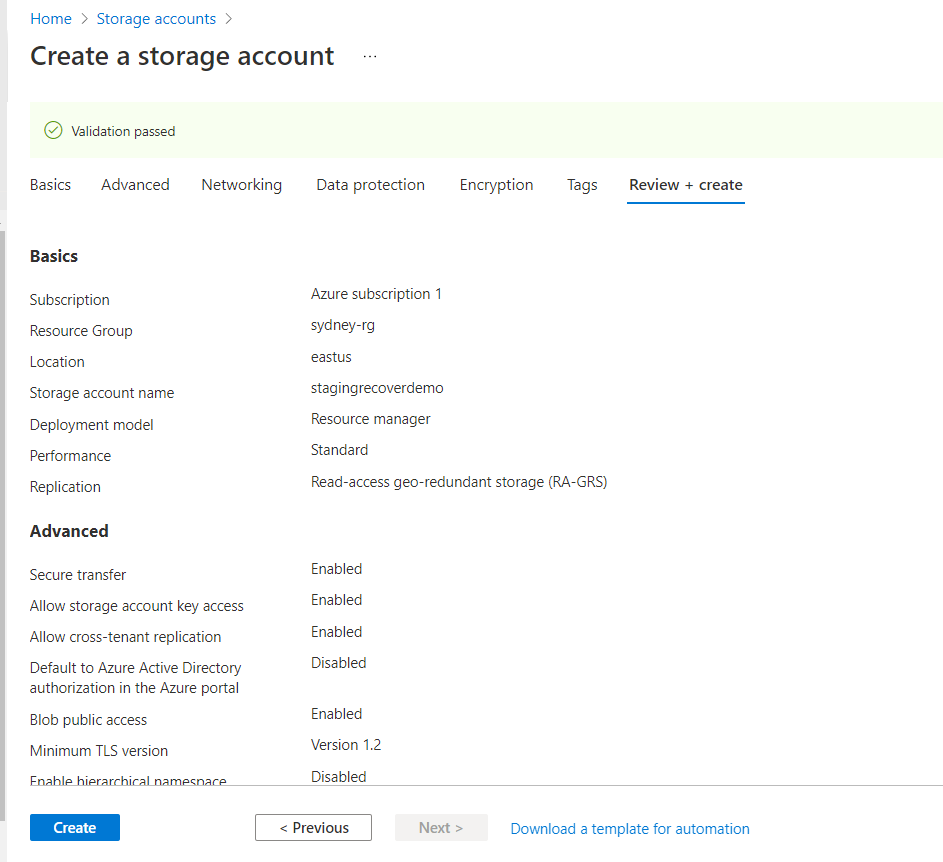
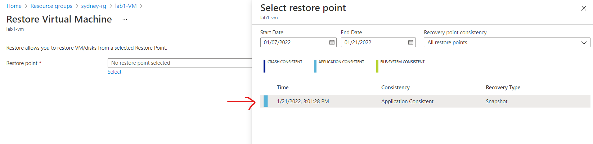
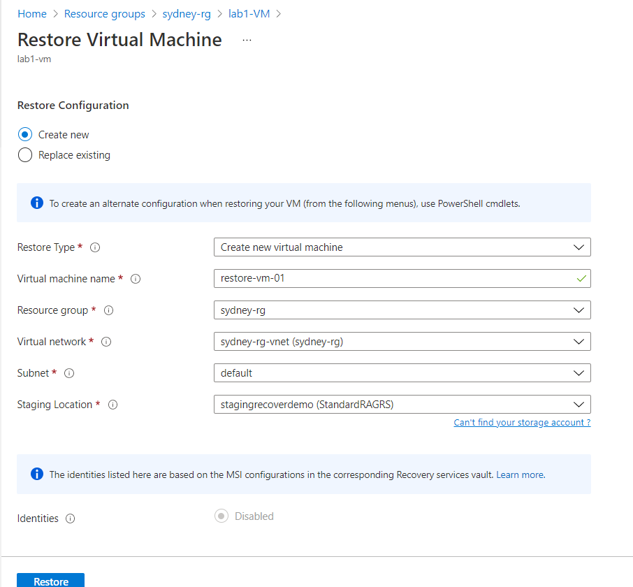
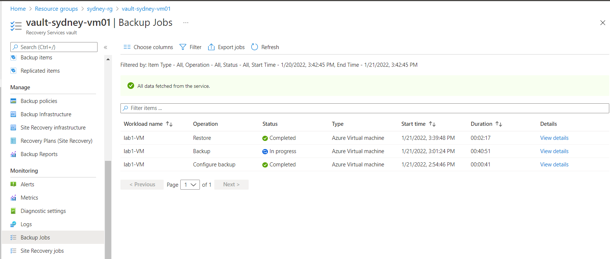

# Azure-VM-Backup-and-Restore
This hands-on lab, I am going to demonstrate Azure VM backup.

Pre-requisites: a Resource Group and a VM

Step 1: Create a backup
Go to VM and select Backup and 
•	create a Recover Services vault 
•	and create a backup policy

If we want to know the progress of our backup: go Vault-sydney-vmo1 then select Backup jobs

Step 2: Restore VM
To restore the VM, I need to stop the VM running first and I need to create a storage account. The region has to be the same at the Recover Services vault’s.

Go to VM and on the Operations select Backup. Click Restore, then select Restore point then you will see a snapshot the File-system Consistent.

Now choose Restore Configuration, crate a new VM and follow the instruction as the image below:

Then go back to the Recover Services vault to see our restore progress.

